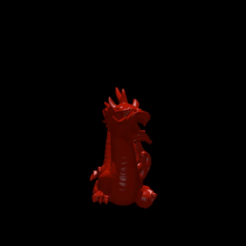

# Ray Tracer for CS 419

## Project

This is a basic ray tracer for production computer graphics (CS 419) at UIUC. It implements intersection of rays with spheres, planes, and triangles. The camera is movable and can use either orthographic or perspective projections. Please explore the code and play with it; all configuration of the objects, lights, and cameras is done in the main file.

Importing meshes from OBJ files is supported, and geometric primitives can be organized in a BVH as an acceleration structure.

Parallelization is done with [Rayon](https://github.com/rayon-rs/rayon).

## Installation and Usage

Install the [Rust toolchain](https://www.rust-lang.org/tools/install) if you don't already have it. Then all you need to do is run `cargo run --release`. Cargo will install necessary dependencies, build the project, and run it. Use the release flag; without the compiler optimizations, the ray tracer is an order of magnitude slower.

## Samples

### Perspective Camera

There is slight distortion due to the perspective, but we get a sense of a physical scene, with the ground plane extending infinitely out to a horizon.

We can also see here that this ray tracer allows for any number of light sources (only two shown), and shading and shadows interact as expected.

### Orthographic Camera

Both spheres appear perfectly circular, and the ground plane is invisible, as it is parallel to the camera's view direction.

## More Samples

## References

For the basic structure and function of the ray tracer, I follow Peter Shirley's [Ray Tracing in One Weekend](https://raytracing.github.io/books/RayTracingInOneWeekend.html).

To accomplish ray-triangle intersection, I followed the Möller–Trumbore ray-triangle intersection algorithm, with an example implementation on [Wikipedia](https://en.wikipedia.org/wiki/Möller–Trumbore_intersection_algorithm).

My implementation of multi-jittered sampling is adapted from [Correlated Multi-Jittered Sampling](https://graphics.pixar.com/library/MultiJitteredSampling/paper.pdf) by Andrew Kensler of Pixar.

My code implementing refraction and reflection is based on the course notes from CS 419, found at the [course web site](https://illinois-cs419.github.io).

My codebase leverages several libraries for parallelization, vector math, PNG generation, and a fun progress bar; you can find these in [`Cargo.toml`](./Cargo.toml).
